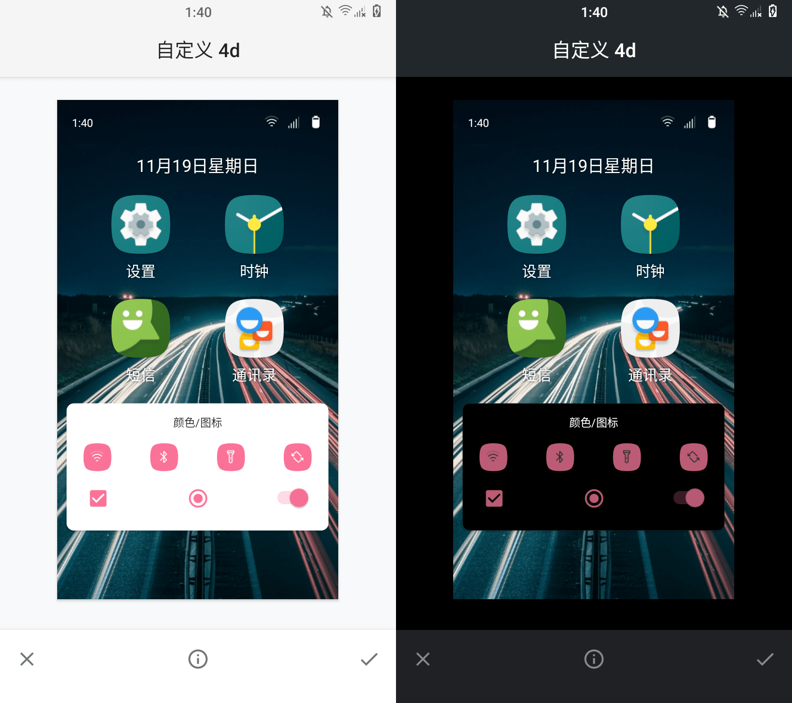

# bilibili Pink


(Android 11/LineageOS 18.1) a hacked together overlay package that makes a much more pleasing shade
of pink be avaliable in ThemePicker

## Building

You will use good old apktool instead of an actual Android build system

```shell
apktool b
```

Then sign the resulting APK with `platform` key

## Installing

Just install the APK you built as if it's a user package, and the pink will be
made selectable in ThemePicker automatically

## License

```xml
<!--
    Copyright (c) 2018, The LineageOS Project
    Copyright (c) 2023 Liu "Dobby233Liu" Wenyuan

    Licensed under the Apache License, Version 2.0 (the "License");
    you may not use this file except in compliance with the License.
    You may obtain a copy of the License at

        http://www.apache.org/licenses/LICENSE-2.0

    Unless required by applicable law or agreed to in writing, software
    distributed under the License is distributed on an "AS IS" BASIS,
    WITHOUT WARRANTIES OR CONDITIONS OF ANY KIND, either express or implied.
    See the License for the specific language governing permissions and
    limitations under the License.
-->
```
*as this is actually based on [LineagePinkAccent](https://github.com/LineageOS/android_packages_overlays_Lineage/tree/lineage-18.1/accents/pink)*